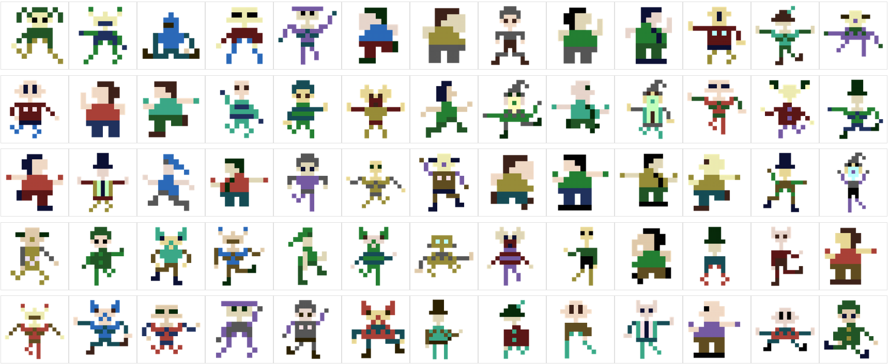

# PixelPic

The random pictures generator. The best idea for random avatars.

## Created by Grzegorz "GAD" Drozd

### version 1.0

### (c) 2020-2022 gadz.pl

https://gadz.pl

# Description

PixelPic is a simple component to draw pixelated small random pictures. It was made mostly for random avatars for visitiors on websites.
It can be configured in database and can draw different types of pictures. Just add some pictures parts and set joints to connect parts together. PixelPic will draw the whole random picture for given random seed. It means that if you use the same seed many times, you'll get always the same picture (until you change the configuration).

# Installation

Just put the files in any desired folder, create the database from the sql script (it is created for MySQL), set your DB credentials in `pixelpicDBConfig.php` file and that's it.

# Usage

    avatar.php?i=randSeed

`randSeed` is a number or string

You can skip the `i` parameter and you'll get random picture every time. But it has a little problem with browser's cache. Once generated picture is saved in cache by browser and every next picture looks the same because it's not generated again. To avoid this behavior always use the `i` parameter with different value.

## Examples

  > avatar.php?i=1234

  > avatar.php?i=myNickName

  > avatar.php?i=someRandomString

  > avatar.php

# Image size

Generated images has one size given in configuration. You can change its size in your style sheets or in `img` tag attributes.

# Example pictures

# Configuration

Configuration can be found in file: `pixelpicConfig.php`

Class `PixelPicConfig` contains default base size of picture given in pixels. Odd number is good when you want the small picture with on pixel in the middle.

Output size of picture is for getting the bigger result picture drawn with interpolation. If you don't want it, just set output size equal to the base size.

# Other images

It is possible to create other images. It can be whatever you want. It must be defined in the database.
